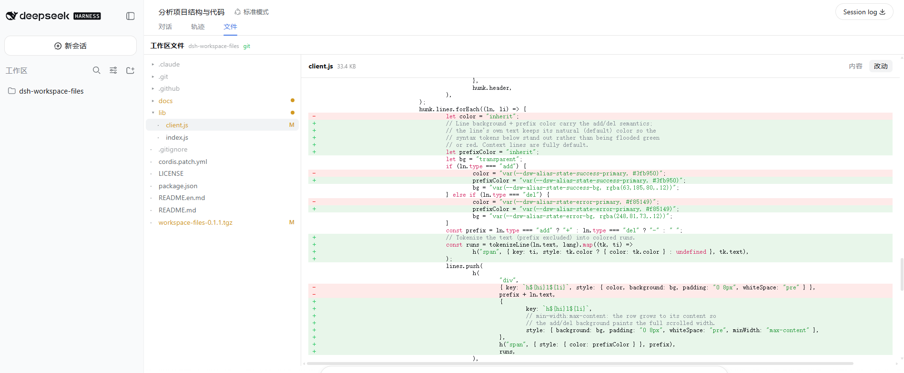

[简体中文](./README.md) | **English**

# workspace-files

> A [DeepSeek Harness (dsh)](https://github.com/deepseek-ai/deepseek-harness) Web GUI plugin — browse the session workspace directory tree, view file contents, and show line-level Git changes (diff), right inside the conversation view.


[](https://linux.do)
[](https://awesome-dsh-plugin.com/p/sqfcyily/dsh-workspace-files/)



## Overview

`workspace-files` adds a "**Files**" tab to the dsh Web GUI conversation view (`conversation.view`), alongside "Chat" and "Trajectory". It lets you:

- 📂 browse the directory tree of the current session's workspace (the session's `cwd`);
- 📄 view text file contents;
- 🔀 if the workspace is a Git repository, show status badges (`M`/`A`/`D`/`R`/`?`) on files and view diffs line by line.

## Features

- **Directory tree browsing** — lazy-loaded expansion, directories sorted first, hidden files (leading `.`) dimmed.
- **File viewing** — UTF-8 text content; binary files are auto-detected and skipped; oversized files are truncated with a notice.
- **Git integration** — working-tree status badges; line-level unified diff for tracked / untracked files (a brand-new file is diffed against the null device via `git diff --no-index`, so its added lines still show).
- **Theme-aware** — uses DSH theme tokens throughout (no hardcoded colors/borders), matching the trajectory view and staying consistent in both light and dark themes.
- **Sandboxed access** — all filesystem access is confined to the session workspace root; path traversal returns `403`.
- **Graceful degradation** — a non-Git directory, a missing `git` binary, or a binary/untracked file each yields a well-formed response; the frontend hides the diff entry and falls back to plain browsing.

## Requirements

- **DeepSeek Harness** (`dsh` CLI) installed and runnable, with the **web** profile enabled.
- **Node.js** — the exact version requirement follows dsh.
- **Git** (optional) — enables the diff feature when on `PATH`; when absent, the plugin degrades to file browsing only.

## Installation

Download the tarball for the version you want from the GitHub Release, then install (web profile):

```powershell
dsh plugin --profile web add ./dsh-workspace-files-0.1.1.tgz
```

Or install straight from GitHub:

```powershell
dsh plugin --profile web add github:sqfcyily/dsh-workspace-files
```

After installing, reopen the dsh Web GUI and a "Files" tab appears at the top of the conversation view.

## Uninstall

```powershell
dsh plugin --profile web remove dsh-workspace-files
```

## Usage

1. Open the dsh Web GUI (default `http://127.0.0.1:3080`).
2. Enter any session and select the "**Files**" tab at the top of the conversation view.
3. In the left directory tree: click a directory to expand it, click a file to view its contents.
4. If the workspace is a Git repository: a status badge shows to the right of each file name; after opening a file, use the top-right "**Content / Changes**" toggle to view the diff.

The workspace root is taken from the current session's `cwd` (the session header dsh records). The plugin resolves it from the host by `sessionId` — no need to specify a path manually.

## Security

- All filesystem access goes through `confine(root, target)`, ensuring the target stays within the session workspace root; otherwise `403` is returned.
- Symlinks are reported by their own kind but **not followed** (kept simple and safe for v1).
- Binary files (a NUL byte within the first 8000 bytes) return no content, only a `binary: true` flag.
- Only `GET` read-only routes are exposed; there is no write / delete / execute interface.

## Verified behavior

- host `/api/workspace-files/session-root`: resolves the session workspace root by `sessionId` (reads the `cwd` header from `sessionPersistence`).
- host `/api/workspace-files/list|read`: directory listing, file read, path traversal returns `403`.
- host `/api/workspace-git/is-repo|status|diff`: repo probe, status parsing, line-level diff for tracked/untracked files.
- non-Git directory / git missing: `is-repo` returns `false`, and the frontend hides the diff entry.
- the client bundle is correctly served via `/plugins/workspace-files/client.js` and appears in the startup manifest.

## Limitations & known constraints

- Syntax highlighting is not wired up yet (currently plain-text `<pre>`).
- Diff is unified (inline) view only; no side-by-side (split) view yet.
- A directory level is capped at 2000 entries; very large directories are truncated (no pagination / incremental lazy loading).
- Symlinks are not followed.

## Roadmap

- [x] Syntax highlighting.
- [ ] Side-by-side (split) diff view.
- [ ] Pagination / incremental lazy loading for very large directories.

## Local development

`lib/` is the source:

```
lib/index.js       host (Node) half — HTTP routes
lib/client.js      browser (React) half — file-browser UI
cordis.patch.yml   web profile patch (inserts the dual-face row)
package.json       package manifest + dsh.bundle / dsh.client declarations
```

Pack an installable tarball:

```powershell
npm pack
```

This produces `workspace-files-<version>.tgz`, the artifact consumed by `dsh plugin add`.

## Related links

- DeepSeek Harness official repo: <https://github.com/deepseek-ai/deepseek-harness>
- Common community plugin topic: [`dsh-plugin`](https://github.com/topics/dsh-plugin)

## License

[MIT](./LICENSE) © 2026 sqfcy
